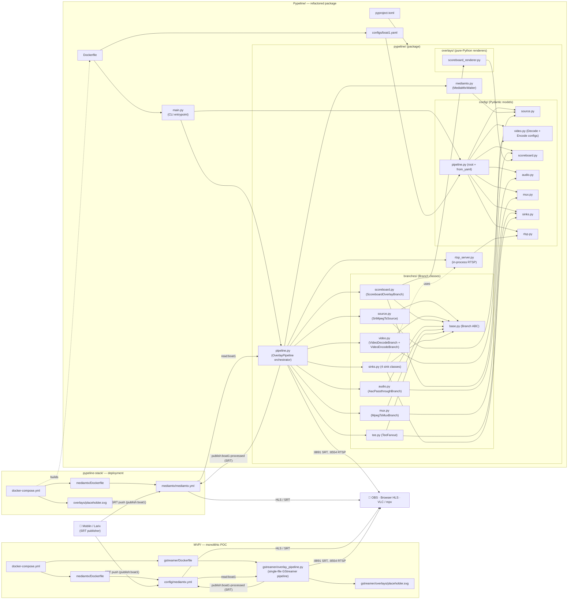

# FishingStreams — Project Map

Live video from a phone (Moblin/Larix → SRT) is ingested by **MediaMTX**, transcoded
and overlaid by a **GStreamer** pipeline (H.265 → H.264 + SVG overlay + scrolling
Cairo scoreboard), then fanned out to OBS, browser HLS, and an RTSP diagnostic endpoint.

The repo contains two generations of the same pipeline plus a deployment stack:

| Top-level dir | Role |
|---|---|
| `MVP/` | First-cut proof-of-concept. Monolithic Python script, self-contained docker-compose stack. |
| `Pypeline/` | Refactor of the MVP into a class-based, YAML-configured Python package (`pypeline`). |
| `pypeline-stack/` | Deployment stack that runs the `Pypeline` image alongside MediaMTX. |

---

## How the files tie together

---

## Root

| Path | Purpose |
|---|---|
| `.gitignore` | Standard Python/macOS ignores plus `*.env`, `*.key`, `*.pem`, and `logs/` to keep secrets and runtime output out of version control. |
| `PROJECT_MAP.md` | This file. |

---

## `MVP/` — original proof-of-concept

A single-file GStreamer pipeline + a MediaMTX container, glued together by
docker-compose. The whole stack lives here and is the documented entrypoint for
new developers: see `MVP/readMe.md` for the end-to-end runbook.

| Path | Purpose |
|---|---|
| `readMe.md` | Full setup runbook: Docker prereqs, phone (Moblin) config, OBS config, port table, and a "Lessons Learned" section capturing real bugs (MediaMTX `action:pathname` requirement, Docker Desktop's broken `network_mode: host`, etc.). |
| `docker-compose.yml` | Two services: `mediamtx` (built from `mediamtx/Dockerfile`) and `gstreamer` (built from `gstreamer/Dockerfile`); declares port mappings (8890 SRT, 8888 API, 8889 HLS, 8891 SRT listener, 8554 RTSP) and shared volumes for logs and overlays. |

### `MVP/mediamtx/`
MediaMTX container image — a stock Ubuntu base + the upstream MediaMTX binary.

| Path | Purpose |
|---|---|
| `Dockerfile` | Ubuntu 24.04 base, downloads MediaMTX `v1.9.3`. Maps Docker's `TARGETARCH=arm64` to MediaMTX's release-filename `arm64v8` before fetching. |

### `MVP/config/`
Runtime config mounted into the MediaMTX container.

| Path | Purpose |
|---|---|
| `mediamtx.yml` | Disables auth (`user: any` / `pass: any`), enables SRT (8890), HLS (8889, fmp4 variant, 2s segments), the HTTP API (8888), and declares paths `boat1` (phone publishes) and `boat1-processed` (GStreamer publishes back). |

### `MVP/gstreamer/`
GStreamer container image and the actual pipeline script.

| Path | Purpose |
|---|---|
| `Dockerfile` | Ubuntu 24.04 + Python 3 + the full `gstreamer1.0-plugins-{base,good,bad,ugly,libav}` set, RTSP-server bindings (`gir1.2-gst-rtsp-server-1.0`), librsvg for SVG overlays, and DejaVu fonts for pango/cairo text rendering. |
| `overlay_pipeline.py` | The pipeline (~300 lines, monolithic). Reads SRT from MediaMTX (`read:boat1`), demuxes MPEG-TS, decodes H.265, applies the SVG overlay, re-encodes to H.264, re-mixes to MPEG-TS, then **tees four ways**: (1) SRT publish back to MediaMTX, (2) `filesink` for diagnostic playback, (3) SRT listener on `:8891` for direct OBS connection, (4) `appsink` → in-process `GstRtspServer` on `:8554`. |
| `overlay_pipeline_DontTouchThisOneWorksWithRTMP_copy.py` | Earlier RTMP-based variant kept around as a known-good reference; not used by the Dockerfile. |
| `overlays/placeholder.svg` | Stub SVG that `rsvgoverlay` blends onto every frame. Real overlay artwork is meant to drop in here. |
| `Temp/overlay_pipeline.py`, `Temp/overlay_pipeline_working.py` | Working scratch copies preserved during iteration. Not part of the build. |

### `MVP/logs/` and `MVP/tmp/`
Both are runtime-only and `.gitignore`d. `logs/mediamtx/mediamtx.log`,
`logs/gstreamer/gst.log`, and `logs/gstreamer/output.ts` are written by the
containers; `tmp/` holds VLC capture logs from earlier debugging.

---

## `Pypeline/` — refactored Python package

Same GStreamer graph as the MVP, but split into a `pypeline` package: every
section of the original script is now an independently configurable
**Branch** subclass driven by Pydantic models loaded from YAML. The MVP's
hardcoded constants become validated, documented config fields with `extra="forbid"`
so typos crash at startup.

| Path | Purpose |
|---|---|
| `main.py` | CLI entrypoint. `argparse` for `--config`, then `PipelineConfig.from_yaml(...)` → `OverlayPipeline(config).run()`. Defaults to `configs/boat1.yaml`. |
| `Dockerfile` | Ubuntu 24.04 + same GStreamer plugin set as the MVP, plus `pip install pydantic>=2 pyyaml>=6` (Ubuntu's apt-shipped `python3-pydantic` is v1, hence pip + `--break-system-packages`). Copies the package and configs in; entrypoint is `python3 /app/main.py`. |
| `pyproject.toml` | Package metadata. Declares `pydantic`, `pyyaml`, and `PyGObject` as deps and configures `setuptools` to auto-discover the `pypeline*` subpackages. |
| `.dockerignore` | Keeps `venv/`, `__pycache__/`, and `reference/` out of the build context. |

### `Pypeline/configs/`

| Path | Purpose |
|---|---|
| `boat1.yaml` | Production config: `srt://mediamtx:8890?streamid=read:boat1` source, x264enc at 5 Mbps with zerolatency tune, all four sinks enabled, RTSP server on `:8554`. Mirrors `reference/original_overlay_pipeline.py` 1:1 by design. |

### `Pypeline/reference/`

| Path | Purpose |
|---|---|
| `original_overlay_pipeline.py` | Frozen copy of the MVP's `overlay_pipeline.py`. Kept as the canonical "what we are refactoring against" reference; never imported. |

### `Pypeline/pypeline/` — the package

The orchestrator + supporting modules. Lifecycle: `OverlayPipeline.__init__`
calls `_build()` which assembles every branch in five phases (build, add to
pipeline, link internal, link inter-branch, dynamic-pad wiring), then `run()`
waits for MediaMTX, starts the GLib main loop, and tears down on signal.

| Path | Purpose |
|---|---|
| `__init__.py` | Package marker / docstring. |
| `pipeline.py` | `OverlayPipeline` — the top-level orchestrator. Constructs each `Branch` from config, wires inter-branch links (video → mux, audio → mux, mux → tee, tee → each sink), registers tsdemux dynamic-pad callbacks, manages the GLib main loop and SIGINT/SIGTERM handlers. |
| `mediamtx.py` | `MediaMtxWaiter` — polls `http://mediamtx:8888/v3/paths/list` until the configured path reports `ready: true`. Optional overall timeout (default infinite, matching the original). |
| `rtsp_server.py` | `RtspServer` — wraps `GstRtspServer.RTSPServer` with a shared `RTSPMediaFactory`. Exposes a single `appsrc` (named `rtsp_src`) that the `RtspBridgeSink` pushes buffers into; safely no-ops when no client is connected. |

#### `Pypeline/pypeline/config/`

Pydantic v2 models. Every model uses `model_config = ConfigDict(extra="forbid")`
so YAML typos raise at validation time rather than being silently ignored.

| Path | Purpose |
|---|---|
| `__init__.py` | Re-exports the model classes for convenient imports. |
| `pipeline.py` | `PipelineConfig` — the root model. Composes `SourceConfig`, `VideoDecodeBranchConfig`, `VideoEncodeBranchConfig`, `ScoreboardConfig`, `AudioBranchConfig`, `MuxConfig`, `SinksConfig`, and `RtspServerConfig`. Provides the `from_yaml(path)` classmethod (load + validate). |
| `source.py` | `SourceConfig` (SRT URI, latency) and `MediaMtxWaitConfig` (api_url, path_name, poll/timeout/request-timeout settings). |
| `video.py` | `VideoDecodeBranchConfig` (currently empty; output is fixed BGRA), `VideoEncodeBranchConfig` (overlay path, raw format, H.264 stream-format and alignment, h264parse `config-interval`), and `EncoderConfig` (x264enc bitrate, GOP, B-frames, `tune`, `speed-preset`). Field docstrings record the *why* — e.g. why I420 is forced and why `byte-stream + au` is required for the mux. |
| `scoreboard.py` | `ScoreboardConfig` (enabled flag, scroll speed, strip geometry, font, colors) and `AnglerEntry` (rank/name/points). The angler list lives in YAML; the renderer in `overlays/scoreboard_renderer.py` consumes this config. |
| `audio.py` | `AudioBranchConfig` — currently empty model; passthrough has no tunables. |
| `mux.py` | `MuxConfig` — `alignment` (defaults to 7 packets so `mpegtsmux` emits 1316-byte buffers, matching SRT's MTU). |
| `sinks.py` | `SinksConfig` — container for all four sink configs plus `TeeQueueConfig`. Each sink has its own model with an `enabled` flag: `SrtPublisherSinkConfig`, `FileRecorderSinkConfig`, `SrtListenerSinkConfig`, `RtspBridgeSinkConfig` (which nests `RtspBridgeAppsinkConfig`). |
| `rtsp.py` | `RtspServerConfig` — port (`8554`), the `factory_launch` gst-launch string, `factory_shared` flag. |

#### `Pypeline/pypeline/branches/`

A `Branch` is a self-contained chain of GStreamer elements. Every branch has
a `build()` (create + configure), a `link_internal()` (link its own elements),
plus an `input_pad` and/or `output_pad` exposed to the orchestrator. Sources
omit `input_pad`; sinks omit `output_pad`; the mux uses request pads instead.

| Path | Purpose |
|---|---|
| `__init__.py` | Re-exports the branch classes for `pipeline.py`. |
| `base.py` | `Branch` (ABC) — defines lifecycle, owns the element list, parents to a `Gst.Pipeline` in `add_to()`. Plus `make_element(factory, name)` which raises a *named* error when a plugin is missing (the MVP's generic "failed to create an element" gave no clue which one). |
| `source.py` | `SrtMpegTsSource` — `srtsrc` → `tsdemux`. Exposes `on_video_pad()` / `on_audio_pad()` so the orchestrator can register pad callbacks; central `pad-added` handler dispatches on caps media-type. |
| `video.py` | `VideoDecodeBranch` (`h265parse → avdec_h265 → videoconvert → capsfilter(BGRA)`) and `VideoEncodeBranch` (`videoconvert → rsvgoverlay → videoconvert → capsfilter(I420) → x264enc → h264parse → capsfilter(byte-stream/au) → queue`). Split from a single class so the scoreboard cairo overlay can sit between the two without coupling decode and encode. |
| `scoreboard.py` | `ScoreboardOverlayBranch` — single-element branch wrapping `cairooverlay`. GStreamer glue only; delegates pixel work to `ScoreboardRenderer` in `overlays/`. Advances scroll position from the buffer timestamp so scroll speed is frame-rate-independent. |
| `audio.py` | `AacPassthroughBranch` — `aacparse → queue`. No decode/re-encode. |
| `mux.py` | `MpegTsMuxBranch` — wraps `mpegtsmux`. Exposes `request_video_pad()` / `request_audio_pad()` that allocate `sink_%d` request pads. |
| `tee.py` | `TeeFanout` — wraps `tee`. `attach_sink(sink)` lazily creates a queue per sink (with `TeeQueueConfig` limits) so a slow sink can't back-pressure the others. |
| `sinks.py` | The four terminal sinks: `SrtPublisherSink` (`srtsink` → MediaMTX), `FileRecorderSink` (`filesink` for diagnostic `.ts`), `SrtListenerSink` (SRT in listener mode for direct OBS connection), `RtspBridgeSink` (`appsink` whose `new-sample` callback pushes buffers into the in-process `RtspServer`). |

#### `Pypeline/pypeline/overlays/`

Pure-Python Cairo renderers. **No GStreamer imports** — the renderer modules
are independently importable and unit-testable with `pycairo` alone. Branches
under `branches/` own the GStreamer plumbing and call into these renderers
from the cairooverlay `draw` signal.

| Path | Purpose |
|---|---|
| `__init__.py` | Empty package marker. |
| `scoreboard_renderer.py` | `ScoreboardRenderer` — draws a horizontally scrolling scoreboard strip onto a `cairo.Context`. Stateless given a `ScoreboardState(x_offset)` snapshot, so the same inputs always produce the same output. |

### `Pypeline/.claude/`, `Pypeline/.idea/`, `Pypeline/venv/`, `Pypeline/__pycache__/`
Local IDE/dev artifacts. Not used by Docker (excluded via `.dockerignore`).

---

## `pypeline-stack/` — deployment

The runtime stack that pairs MediaMTX with the `Pypeline` image. Code lives
in `Pypeline/`; this directory owns *only* deployment concerns. The compose
file points the gstreamer service's build context at `../Pypeline`, so the
two can move independently.

> ⚠️ Ports 8890, 8888, 8889, 8891, 8554 collide with the `MVP/` stack. Run only one at a time.

| Path | Purpose |
|---|---|
| `docker-compose.yml` | Two services: `mediamtx` (built locally from `./mediamtx`) and `gstreamer` (built from `../Pypeline`, the package). Same port mappings as the MVP. |
| `.gitignore` | Local-only ignores on top of the repo-level `.gitignore`. |

### `pypeline-stack/mediamtx/`
| Path | Purpose |
|---|---|
| `Dockerfile` | Identical to `MVP/mediamtx/Dockerfile`: Ubuntu 24.04 + MediaMTX `v1.9.3` with the `arm64 → arm64v8` filename mapping. |
| `mediamtx.yml` | MediaMTX runtime config — same shape as the MVP variant: auth disabled for dev, SRT/HLS/API enabled, `boat1` and `boat1-processed` paths declared. |

### `pypeline-stack/overlays/`
| Path | Purpose |
|---|---|
| `placeholder.svg` | Mounted read-only into the gstreamer container at `/overlays/placeholder.svg` (the path `boat1.yaml`'s `video.overlay_path` resolves to). |

### `pypeline-stack/logs/`
Runtime-only output volumes for `mediamtx/` and `gstreamer/`. `.gitignore`d.
